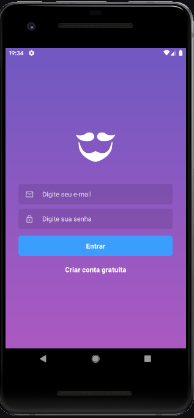
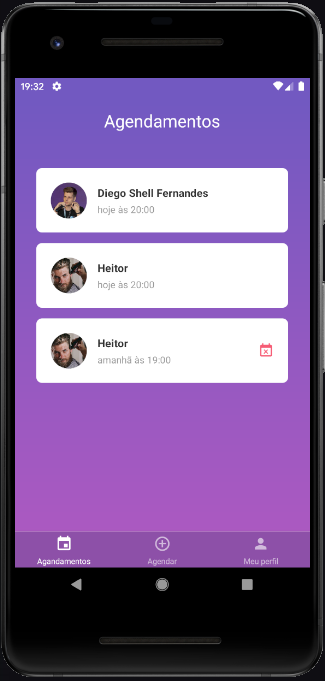
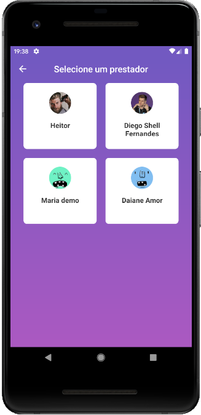
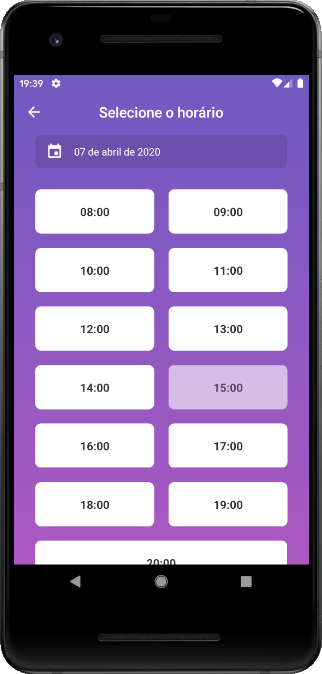

<h1 align="center">
    
</h1>

<h3 align="center">
  💈🪒 GoBarber 🧔💜
</h3>

  <a href="#rocket-sobre-o-desafio">Sobre</a>&nbsp;&nbsp;&nbsp;|&nbsp;&nbsp;&nbsp;
  <a href='#gear-oque-foi-utilizado'>Oque foi utilizado</a>&nbsp;&nbsp;&nbsp;|&nbsp;&nbsp;&nbsp;
  <a href="#camera-imagens">Imagens</a>&nbsp;&nbsp;&nbsp;|&nbsp;&nbsp;&nbsp;
  <a href="#Instalar e usar">Instalar e usar</a>

## 💈 Sobre

 O gobarber é um sistema para agendamentos de serviços de beleza, e esté e o aplicativo android e iOS, para os clientes fazer o agendamento com o provedor escolhido.

## ⚙️ Oque foi utilizado
<ul>
  <li>UnForm</li>
  <li>React</li>
  <li>React Native</li>
  <li>React Navigation v5.0</li>
  <li>styled-components</li>
  <li>React hooks</li>
  <li>Redux</li>
  <li>Redux Persist</li>
  <li>Redux Saga</li>
  <li>Select</li>
  <li>Axios</li>
  <li>date-fns</li>
  <li>immer</li>
  <li>polished</li>
  <li>yup</li>
</ul>

## 📷 Imagens

<strong>Login</strong>

 
<strong>Registro</strong>

 
<strong>Perfil do provedor.</strong>

 
<strong>Agendamentos</strong>

 
<strong>Novo Agendamento</strong>

  
  
  

 

## 🚀 Instalar e usar

###### Clone o respostiorio.
``git clone git@github.com:nelsonplinio/gobarber-mobile.git``

###### Instalar as dependencias.
``cd gobarber-mobile ``
`` yarn ou npm install``

###### Rodar projeto.
``react-native run-android ou npx react-native run-android ``
``react-native run-ios ou npx react-native run-ios ``
